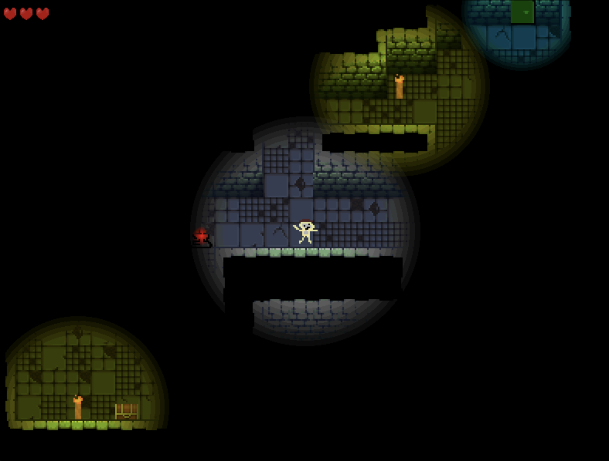
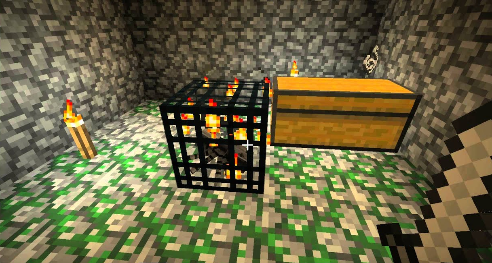

<!-- markdownlint-disable MD033-->
# Game Design Document –– Unilluminated

Repozitár obsahuje prototyp hry "Unilluminated", ktorá je mojim semestrálnym projektom ku skúške z predmetu "Objektové technológie" na FPVaI, UKF.

- **Autor:** Kevin Svitač
- **Zvolená téma:** Dark and light

## 1. Úvod

Pre môj projekt som si zvolil tému "Dark and light" (tma a svetlo). V hre sa hráč nachádza v temných kobkách, kde jediným zdrojom svetla je lúč ktorý vyžaruje okolo seba, pár pochodní. Na hrdinu tam čakajú aj príšery, niektoré ho naháňajú, iné iba chodia náhodným smerom a dúfajú, že hráča chytia. Cieľom v každom leveli je nájsť truhlu s kľúčom, ktorý sa následne použije pre otvorenie dverí - a samozrejme, vyhnúť sa príšerám, inak celá hra končí.

<b>Obrázok č. 1:</b> Snímka finálnej hry.

### 1.1 Inšpirácia

Téma "Dark and light" ma zaujala, pretože som pôvodne mal nápad vytvoriť hru, kde bude nevyhnutné celý level osvetliť pomocou pochodí ktorých bude mať na začiatku hráč obmedzený počet a zabrániť tak príšerám v tom, aby sa rodili (podobne ako to je jednou z úloh v populárnej hre [Minecraft](https://minecraft.net)). Tento repozitár obsahuje prototyp jednoduchšej verzie hernej mechaniky, kde je namiesto toho cieľom nájsť kĺúč od ďalšej miestnosti.

<b>Obrázok č. 2:</b> Inšpirácia originálnej mechaniky pre svetlo z hry Minecraft.

### 1.2 Herný zážitok

Hráč sa ocitne v temných kobkách, z ktorých má ujsť pred príšerami - ale predtým musí nájsť kľúč od dverí do ďalšej miestnosti, ktorý je ukrytý niekde v tme, v truhle.

### 1.3 Použitý softvér

- [Pygame Community Edition (v2.5.2)](https://pypi.org/project/pygame-ce/)
- [Python 3.13.1](https://python.org)
- [Tiled 1.11.0](https://thorbjorn.itch.io/tiled) - pre tvorbu levelov
- [Audacity](https://audacityteam.org/) - pre úpravu zvukov

### 1.4 Použité assety

- [Damp Dungeon Tileset](https://pine-druid.itch.io/damp-dungeon-tileset-and-sprites)
- [Fira Code (Font)](https://github.com/tonsky/FiraCode)
- Zvukové efekty od [freesound_community (Pixabay)](https://pixabay.com/users/46691455)
- Hudba na pozadí od [Suno AI](https://suno.com/)

## 2. Koncept

## 2.1 Prehľad hry

Pre tému "Dark and light" som zvolil mechaniku toho, že hráč zakaždým vidí iba určitú časť svojho okolia, inak je všade tma. Hráč má k dispozícií (obmedzený) počet pochodní, ktoré môže položiť na zem, vďaka čomu môže permanentne osvetliť určitú časť hernej mapy (napr. aby vedel, kde sa nachádzajú nepriatelia, alebo aby si označil cestu kde už bol predtým a nestratil sa).

Príšery sa v aktuálnej verzii prototypu nedajú žiadnym spôsobom zničiť. Jediným spôsobom ako sa zachrániť, je nájsť kľúč v truhle ktorá sa nachádza v niektorej neosvetlenej časti levelu a potom ísť za modrým svetlom, ktoré vyžaruje z dverí do ďalšieho levelu. Dvere sa môžu otvoriť iba pomocou vyššie spomínaného kľúča.

Hráč po kontakte s ľubovolnou príšerou stratí jeden život, pričom v každom leveli má k dispozícií maximálne 3 - ak stratí všetky, celá hra končí.
