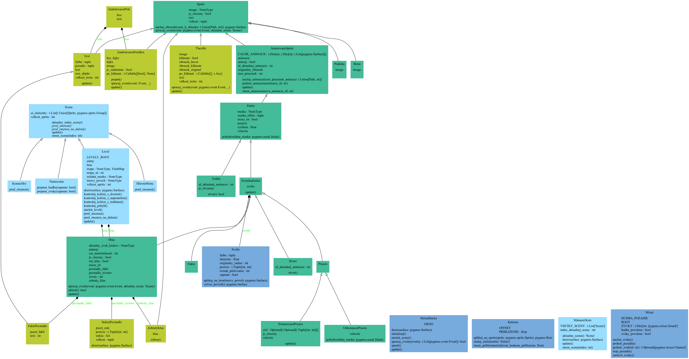

<!-- markdownlint-disable MD033-->
# Game Design Document –– Unilluminated

Repozitár obsahuje prototyp hry "Unilluminated", ktorá je mojim semestrálnym projektom ku skúške z predmetu "Objektové technológie" na FPVaI, UKF.

- **Autor:** Kevin Svitač
- **Zvolená téma:** Dark and light

---

## 1. Úvod

Pre môj projekt som si zvolil tému "Dark and light" (tma a svetlo). V hre sa hráč nachádza v temných kobkách, kde jediným zdrojom svetla je lúč ktorý vyžaruje okolo seba, pár pochodní. Na hrdinu tam čakajú aj príšery, niektoré ho naháňajú, iné iba chodia náhodným smerom a dúfajú, že hráča chytia. Cieľom v každom leveli je nájsť truhlu s kľúčom, ktorý sa následne použije pre otvorenie dverí - a samozrejme, vyhnúť sa príšerám, inak celá hra končí.

<b>Figúra č. 1:</b> Snímka skorého prototypu hry počas vývoja.

### 1.1 Inšpirácia

Téma "Dark and light" ma zaujala, pretože som pôvodne mal nápad vytvoriť hru, kde bude nevyhnutné celý level osvetliť pomocou pochodí ktorých bude mať na začiatku hráč obmedzený počet a zabrániť tak príšerám v tom, aby sa rodili (podobne ako to je jednou z úloh v populárnej hre [Minecraft](https://minecraft.net)). Tento repozitár obsahuje prototyp jednoduchšej verzie hernej mechaniky, kde je namiesto toho cieľom nájsť kĺúč od ďalšej miestnosti.

<b>Figúra č. 2:</b> Inšpirácia originálnej mechaniky pre svetlo z hry Minecraft.

### 1.2 Herný zážitok

Hráč sa ocitne v temných kobkách, z ktorých má ujsť pred príšerami - ale predtým musí nájsť kľúč od dverí do ďalšej miestnosti, ktorý je ukrytý niekde v tme, v truhle.

### 1.3 Použitý softvér

- [Pygame Community Edition (v2.5.2)](https://pypi.org/project/pygame-ce/)
- [Python 3.13.1](https://python.org)
- [Tiled 1.11.0](https://thorbjorn.itch.io/tiled) - pre tvorbu levelov
- [Audacity](https://audacityteam.org/) - pre úpravu zvukov
- [pyreverse](https://pylint.readthedocs.io/en/latest/additional_tools/pyreverse/index.html) - tvorba UML diagramu tried

---

## 2. Koncept

### 2.1 Prehľad hry a interpretácia témy

Pre tému "Dark and light" som zvolil mechaniku toho, že hráč zakaždým vidí iba určitú časť svojho okolia, inak je všade tma. Hráč má k dispozícií (obmedzený) počet pochodní, ktoré môže položiť na zem, vďaka čomu môže permanentne osvetliť určitú časť hernej mapy (napr. aby vedel, kde sa nachádzajú nepriatelia, alebo aby si označil cestu kde už bol predtým a nestratil sa).

Príšery sa v aktuálnej verzii prototypu nedajú žiadnym spôsobom zničiť. Jediným spôsobom ako sa zachrániť, je nájsť kľúč v truhle ktorá sa nachádza v niektorej neosvetlenej časti levelu a potom ísť za modrým svetlom, ktoré vyžaruje z dverí do ďalšieho levelu. Dvere sa môžu otvoriť iba pomocou vyššie spomínaného kľúča.

Hráč po kontakte s ľubovolnou príšerou stratí jeden život, pričom v každom leveli má k dispozícií maximálne 3 - ak stratí všetky, celá hra končí.

### 2.2 Základné mechaniky

- **2 druhy nepriateľov**: príšera ktorá sa odráža od stien a príšera, ktorá priamo nasleduje hráča;
- **truhla s kľúčom**: každý level obsahuje truhľu s kľúčom, ktorú musí hráč nájsť;
- **dvere do ďalšieho levelu**: hráč musí pomocou kľúča otvoriť dvere pre postup do ďalšieho levelu;
- **pochodne**: hráč má k dispozícií obmedzený počet faklí, ktoré môže položiť alebo zobrať a ktoré vyžarujú svetlo, môžu slúžiť ako orientačné body v mape, alebo pre odhalenie pozícií príšer;
- **kamera**: kamera nasleduje hráča a je možné ju priblížiť alebo oddialiť, čo pomôže pre lepšiu orientáciu v mape, ak si hráč bludisko osvietil pomocou pochodní

### 2.3 Návrh tried

- [`HernaSlucka`](./triedy/herna_slucka.py) - obsahuje hlavnú hernú slučku, ktorá sleduje Pygame eventy a všetko vykresľuje;
- [`Kamera`](./triedy/kamera.py) - kontroluje pozíciu a zoom kamery, obsahuje funkciu pre vykreslenie sprite v závislosti od kamery;
- [`Mixer`](./triedy/mixer.py) - mieša a prehráva zvuky a hudbu na pozadí, ak sú povolené v herných nastaveniach;

Nasledujúce priečinky obsahujú viacero tried, ktoré iba stručne popíšem (pre konkrétnu technickú dokumentáciu si prosím prečítajte komentáre a docstringy ktoré sú dostupné v daných zdrojových kódoch spomínaných tried):

- [`sceny`](./triedy/sceny/) - obsahuje rodiča `Scena`, ktorá predstavuje jednu scénu (panel) v hre. Scény možno meniť, napr. hlavné menu je samostatná scéna, menu s nastaveniami je iná, a podobne;
  - [`levely`](./triedy/sceny/levely/) - trieda `Level` obsahuje hlavnú hernú logiku, slučku levelu (kontrolu kolízií, parsovanie levelu a podobne);
- [`sprity`](./triedy/sprity/) - obsahuje rodiča `Sprite`, čo predstavuje nejaký obrázok vykresľovaný na scéne (obsahuje potomkov, ako napr.: `AnimovanySprite`, ktorý podporuje animácie);
  - [`entity`](./triedy/sprity/entity/) - `Entita` je všetko, s čím sa dá v leveli interagovať, či už v dobrom alebo v zlom (`Fakla`, `Prisera`, `Dvere` a podobne);
- [`ui`](./triedy/ui/) - UI elementy (`Tlacidlo`, `ZaskrtavaciePole`, `Text` a podobne);

<b>Figúra č. 3:</b> UML diagram, generovaný pomocou <a href="https://pylint.readthedocs.io/en/latest/additional_tools/pyreverse/index.html">pyreverse</a>.

## 3. Použité assety

Assety som čerpal z voľne dostupných zdrojov na internete, zvyšok čo tu nie je popísané som vytvoril sám. V rámci funkčného prototypu som nehľadal najlepší možný dizajn, ale taký, ktorý je dostatočne prívetivý pre testerov hry.

- [Damp Dungeon Tileset](https://pine-druid.itch.io/damp-dungeon-tileset-and-sprites)
- [Fira Code (Font)](https://github.com/tonsky/FiraCode)
- Zvukové efekty od [freesound_community (Pixabay)](https://pixabay.com/users/46691455)
- Hudba na pozadí od [Suno AI](https://suno.com/)

## 4. Herný zážitok

### 4.1 Používateľské rozhranie

UI je jednoduché - hlavná obrazovka obsahuje možnosť začat hru, menu s nastaveniami (kde sa dajú zapnúť a vypnúť zvuky alebo hudba v pozadí) a možnosť hru ukončiť. Taktiež je tu menu s možnosťami návratu do hlavného menu alebo ukončenia hry v prípade že bol stlačený kláves `Escape` alebo hráča premohli nepriatelia.

### 4.2 Ovládanie

Hráč ovláda postavu pomocou <ins>klávesnice</ins>:

- **Pohyb:** šípkami vo všetkých 8 smeroch (priamo alebo diagonálne);
- **Položenie/zobratie fakle:** medzerník (`Space`);
- **Koniec hry/návrat do menu:** Escape
- **Reštart aktuálneho levelu:** R
- **Priblíženie kamery:** P
- **Oddialenie kamery:** O

Interakcie s truhlou a dvermi sú automatické - stačí, ak sa k ním hráč priblíži (pre odomknutie dverí je potrebné mať so sebou kľúč).

## 5. Gameplay video

<b>Figúra č. 4:</b> <a href="https://youtu.be/PRYxeDCJFS4">Gameplay video</a> prototypu počas vývoja (*pozn.: nezodpovedá aktuálnemu stavu hry*).

## 6. Stiahnutie

Prototyp hry je k dispozícií k stiahnutiu ako [release](https://github.com/SKevo18/unilluminated/releases).
